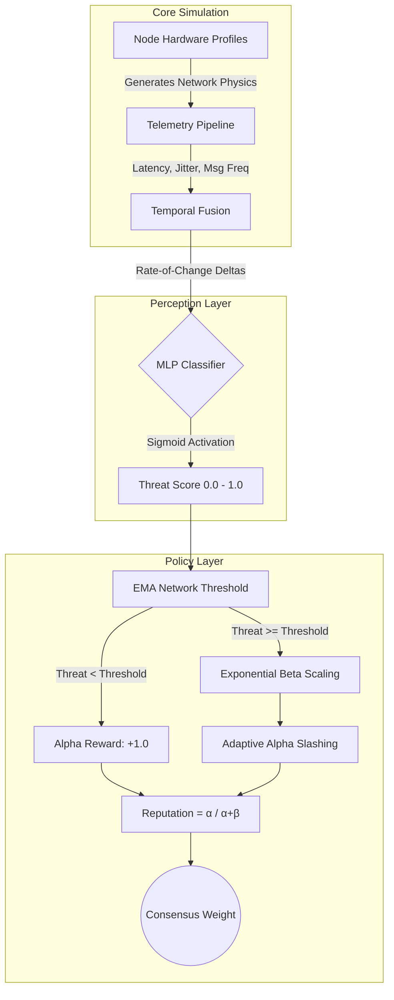

# Consensus Arena: ML-Driven BFT Simulator


## Abstract
Consensus Arena is a Byzantine Fault Tolerance (BFT) blockchain simulator designed to test adversarial mitigation under chaotic network constraints. Traditional BFT systems rely on rigid, hardcoded heuristics that fail in high-latency environments (e.g., Satellite, Public Wi-Fi). This project solves that by replacing static heuristics with a **Machine Learning Perception Layer** (`MLPClassifier`) and an **Adaptive Bayesian Policy Engine**.

## System Architecture

The pipeline is decoupled into three distinct layers: Telemetry, Perception, and Policy. 



### 1. Perception Layer (Machine Learning)
Instead of hardcoded rules, network telemetry is passed into an `MLPClassifier`. To prevent "Sleeper Attacks" or "Yo-Yo Stealth Attacks", the model utilizes **Temporal Fusion**—tracking 6 historical deltas (rate-of-change) to detect sudden anomalies in behavior, yielding a probabilistic threat score.

### 2. Policy Layer (Bayesian Reputation)
Threat scores do not directly slash nodes. They are passed to a Bayesian Beta Reputation system (`Reputation = α / α + β`).
* **EMA Baselines:** The punishment threshold dynamically adjusts to the global network mean, preventing mass false-positives during simulated global outages.
* **Adaptive Trust Slashing:** Threat scores near 99% trigger critical penalties—exponentially scaling the `beta` (suspicious) counter and mathematically slashing the `alpha` (honest history) cushion.

## Installation

**Prerequisites:** Python 3.14 or higher.

```bash
# 1. Clone the repository
git clone https://github.com/your-username/consensus-arena.git
cd consensus-arena

# 2. Install dependencies
pip install -r requirements.txt

# 3. Initialize the Simulation Server
python backend/main.py
```

## Usage
Once the WebSocket backend is initialized on `localhost`, open `frontend_web/index.html` in any Chromium-based browser to access the dynamic simulation dashboard.

## Directory Structure

```text
├── backend/
│   ├── mitigation/         # Bayesian reputation engine & EMA logic
│   ├── ml/                 # Neural network models and active training datasets
│   ├── simulator/          # Core consensus loop (PBFT, PoW, PoS)
│   └── main.py             # Entry point & WebSocket configuration
├── frontend_web/           # Vanilla JS/Canvas visualization dashboard
└── requirements.txt
```
