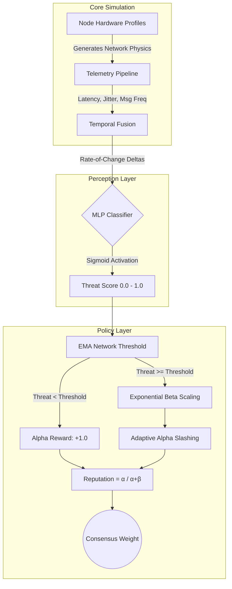

# Consensus Arena: ML-Driven BFT Simulator


## Abstract
Consensus Arena is a comprehensive Byzantine Fault Tolerance (BFT) blockchain simulator engineered to test adversarial mitigation under chaotic, real-world network constraints. Traditional BFT consensus mechanisms rely on rigid, hardcoded heuristics that fail in high-latency or packet-loss environments. This project solves that limitation by replacing static rule sets with a dual-engine approach: a **Machine Learning Perception Layer** (`MLPClassifier`) for threat detection, coupled with an **Adaptive Bayesian Policy Engine** for decentralized reputation management.

---

## System Architecture

The pipeline is strictly decoupled into three computational layers to ensure that perception (threat detection) and policy (punishment) do not contaminate the underlying consensus physics.



---

## 1. Core Simulation & Consensus

The core simulator handles real-time WebSocket broadcasting and block round execution. 

### Pluggable Consensus Mechanisms
The arena supports hot-swapping between major consensus algorithms to observe how Byzantine threats impact different network topologies:
* **PBFT (Practical Byzantine Fault Tolerance):** Classic 3-phase commit requiring 2f+1 votes. Mitigates quarantined nodes by dynamically dropping their messages and recomputing the `f` fault tolerance threshold.
* **PoS (Proof of Stake):** Block proposers are weighted by their Bayesian Reputation score. Quarantined nodes experience a 100% stake slash.
* **DPoS (Delegated Proof of Stake):** Reputation-weighted round-robin delegation. Flagged delegates trigger immediate emergency re-elections.
* **PoW (Proof of Work):** Simulates hash-target difficulty. Blocks mined by Blacklisted nodes are automatically orphaned.

### Hardware Simulation Profiles
To train the ML models robustly, nodes are assigned diverse hardware and network profiles. This forces the AI to distinguish between a malicious DDoS attack and a benign router malfunction.
* **Fiber Optic / Datacenter:** Low latency (10-30ms), 0% packet loss.
* **Standard / 3G Mobile:** Moderate latency (80-200ms), slight jitter.
* **Public Wi-Fi / Satellite:** Extreme latency (500-1500ms), high silence ratio.
* **Extreme Chaos:** Simulates environmental `lag_timers` causing sudden, massive ping spikes across the network.

---

## 2. Perception Layer (Machine Learning)

The perception layer acts as the AI "brain" of the network, replacing hardcoded threshold rules.

### Deep Learning Architecture
* **Primary Model:** `MLPClassifier` (Multi-Layer Perceptron) utilizing ReLU activation in hidden layers and Sigmoid output for continuous probabilistic threat scoring.
* **Secondary Model:** `IsolationForest` for unsupervised anomaly detection.

### Feature Engineering & Temporal Fusion
The AI ingests 11 distinct telemetry features. Crucially, it utilizes **Temporal Fusion**—tracking historical deltas to catch "Stealth Nodes" that attempt to yo-yo between malicious and honest behavior.

| Feature | Description | Target Adversary |
|---------|-------------|------------------|
| `msg_freq` | Raw messages sent per second | DDoS / Spammers |
| `latency` | Ping response time in MS | Eclipse / Routing attacks |
| `vote_inconsistency` | Rate of contradictory block votes | Equivocation / Liars |
| `fork_attempts` | Attempts to propose parallel blocks | Sybil / Forkers |
| `msg_freq_delta` | Temporal rate of change in speed | Stealth / Sleeper attacks |
| `vote_drift_delta` | Sudden shifts in voting alignment | Sleeper attacks |

---

## 3. Policy Engine (Bayesian Reputation)

Threat scores from the ML layer (0.0 - 1.0) do not directly punish nodes. They are passed to a Beta Bayesian Reputation system (`Reputation = α / α + β`) which converts raw probabilities into historical trust.

### Advanced Mitigation Mechanics
* **EMA Network Threshold:** The baseline "punishment threshold" is not hardcoded. It uses an Exponential Moving Average (EMA) of the entire network's health. If a global internet outage occurs, the threshold dynamically rises to prevent mass false-positive punishments.
* **Exponential Beta Scaling:** Minor offenses (e.g., 45% threat) incur a gentle `beta` increment. Severe offenses (99% threat) trigger an exponential multiplier (`exp(8.0 * excess)`), resulting in critical reputation damage.
* **Adaptive Alpha Slashing:** The "Sleeper Attack" vector is mitigated by burning historical trust. A 99% threat instantly slashes a node's `alpha` (Good History) to 5%, preventing hackers from hiding behind past good behavior.

### Consensus Status Tiers
| Status | Reputation | Consensus Impact |
|---|---|---|
| **Verified** | ≥ 90% | Full voting weight, eligible for DPoS delegation. |
| **Trusted** | ≥ 70% | Standard voting weight. |
| **Watched** | ≥ 50% | Warning state, votes are scrutinized. |
| **High Risk** | ≥ 30% | Severe restrictions, blocks heavily audited. |
| **Quarantined**| ≥ 10% | Node is neutralized. Votes count for 0. |
| **Blacklisted**| < 10% | Node is dead. Ignored by all network peers. |

---

## 4. Human-in-the-Loop Training UI

The frontend is a dynamic vanilla HTML5/JS Canvas dashboard that connects to the Python simulation via WebSockets. 

**Live Online Training:** The UI features a manual training hook. Operators can monitor the ML Threat panel and manually inject `False Positive` or `Missed Attack` labels. The Python backend instantly appends this to `master_training_data.csv` and hot-reloads the Neural Network in memory without requiring a server restart.

---

## Installation & Usage

**Prerequisites:** Python 3.14 or higher.

```bash
# 1. Clone the repository
git clone https://github.com/your-username/consensus-arena.git
cd consensus-arena

# 2. Install dependencies
pip install -r requirements.txt

# 3. Initialize the Simulation Server
python backend/main.py
```

Once the WebSocket backend is initialized on `localhost`, open `frontend_web/index.html` in any Chromium-based browser to access the dynamic simulation dashboard.

---

## Directory Structure

```text
├── backend/
│   ├── mitigation/         # Bayesian reputation engine & EMA logic
│   ├── ml/                 # Neural network models and active training datasets
│   ├── simulator/          # Core consensus loop (PBFT, PoW, PoS)
│   └── main.py             # Entry point & WebSocket configuration
├── frontend_web/           # Vanilla JS/Canvas visualization dashboard
│   ├── index.html          
│   └── app.js              
└── requirements.txt
```
