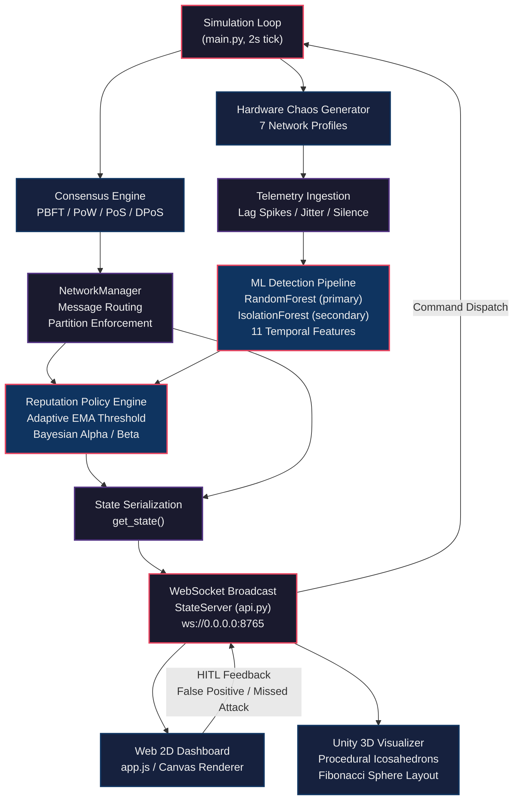

# NeuralBFT

**Real-time Byzantine Fault Tolerance simulation with machine learning-driven anomaly detection, adaptive Bayesian reputation scoring, and dual-frontend visualization.**

NeuralBFT is a full-stack distributed systems research platform that simulates consensus protocols (PBFT, PoW, PoS, DPoS) under adversarial conditions, detects Byzantine nodes using a dual-model ML pipeline (RandomForest + IsolationForest), and renders the entire network state in real time through both a 2D web dashboard and a 3D Unity visualizer.

---

## Table of Contents

- [Architecture Overview](#architecture-overview)
- [System Requirements](#system-requirements)
- [Installation](#installation)
- [Usage](#usage)
- [Backend](#backend)
  - [Simulation Core](#simulation-core)
  - [Consensus Engine](#consensus-engine)
  - [ML Detection Pipeline](#ml-detection-pipeline)
  - [Reputation Policy Engine](#reputation-policy-engine)
  - [WebSocket Transport](#websocket-transport)
- [Web Frontend](#web-frontend)
- [Unity 3D Visualizer](#unity-3d-visualizer)
- [Human-in-the-Loop Active Learning](#human-in-the-loop-active-learning)
- [Project Structure](#project-structure)
- [License](#license)

---

## Architecture Overview



The system operates on a fixed 2-second tick. Each round, the simulation loop executes consensus, generates per-node telemetry influenced by hardware profiles, evaluates ML threat scores, updates Bayesian reputation counters, and broadcasts the full state snapshot over WebSocket to all connected visualization clients.

---

## System Requirements

| Component | Version |
|-----------|---------|
| Python | 3.14+ |
| Unity | 6000.6.0f1 (Unity 6) |
| Node.js | Not required (static frontend) |
| OS | Windows 10/11 (tested), Linux/macOS (backend only) |

---

## Installation

### Backend

```bash
git clone https://github.com/kunjpatel007-gif/NeuralBFT.git
cd NeuralBFT
pip install -r requirements.txt
```

**Generate the training dataset and train the ML model (first-time setup):**

```bash
python backend/ml/data_generator.py
python backend/ml/train.py
```

The detector will also bootstrap itself automatically on first run if no `master_training_data.csv` is found.

### Web Frontend

No build step required. Serve `frontend_web/` with any static file server, or open `index.html` directly in a browser. The dashboard connects to `ws://localhost:8765` by default; override with the `?ws=` URL parameter.

### Unity Visualizer

Open `unity/My project/` in Unity 6 (6000.x). The scene is pre-configured with all prefabs, materials, and scripts. Enter Play Mode while the Python backend is running to establish the WebSocket connection.

---

## Usage

**Start the simulation backend:**

```bash
python backend/main.py
```

This initializes a 10-node network running PBFT consensus, starts the WebSocket server on port 8765, and begins the simulation loop.

**Access the web dashboard:**

Open `frontend_web/index.html` in a browser. The dashboard provides real-time controls for:

- Hot-swapping consensus algorithms (PBFT, PoW, PoS, DPoS)
- Injecting Byzantine faults (Offline, Malicious, Stealth, Honest Heal)
- Triggering network partition split-brain attacks
- Dynamic node scaling (4 to 50 nodes)
- Human-in-the-loop ML corrections (False Positive / Missed Attack)

**Launch the Unity visualizer:**

Open the Unity project and enter Play Mode. The 3D visualizer renders nodes as procedurally generated flat-shaded Icosahedrons distributed across a Fibonacci sphere, with real-time message flight animations and interactive HUDs.

---

## Backend

### Simulation Core

**`backend/simulator/node.py`**

Defines the `Node` and `Message` dataclasses. Each node maintains:

- `reputation: float` -- Continuous score on [0.0, 100.0] derived from Bayesian counters.
- `alpha: float` / `beta: float` -- Beta distribution parameters for trust estimation.
- `partition_id: int` -- Network segment assignment for split-brain simulations.
- `status: str` -- Discrete tier computed from reputation thresholds:

| Reputation Range | Status Tier |
|-------------------|-------------|
| >= 90.0 | Verified |
| >= 70.0 | Trusted |
| >= 50.0 | Watched |
| >= 30.0 | High Risk |
| >= 10.0 | Quarantined |
| < 10.0 | Blacklisted |

**`backend/simulator/network.py`**

The `NetworkManager` class orchestrates round execution, message routing, and state serialization. Message delivery enforces partition boundaries: messages between nodes with differing `partition_id` values are silently dropped, modeling physical network severance.

**`backend/main.py`**

The main loop assigns each node one of seven weighted hardware profiles that determine baseline telemetry behavior:

| Profile | Weight | Base Latency | Spike Chance |
|---------|--------|-------------|-------------|
| Datacenter / LAN | 10% | ~5ms | 0.5% |
| Fiber Optic | 20% | ~30ms | 2% |
| Standard Wi-Fi | 30% | ~80ms | 5% |
| Satellite | 15% | ~800ms | 8% |
| Public Cafe Wi-Fi | 15% | ~200ms | 15% |
| Throttled 3G | 5% | ~1200ms | 10% |
| Faulty Router | 5% | ~5000ms | 20% |

Lag spikes persist for 1-6 rounds, generating elevated latency and silence metrics that the ML detector must distinguish from genuine Byzantine behavior.

### Consensus Engine

All consensus implementations extend `BaseConsensus` and are hot-swappable at runtime via WebSocket commands.

**PBFT (`PBFTMechanism`)** -- Three-phase broadcast protocol (Pre-Prepare, Prepare, Commit). Requires 2f+1 quorum where f = floor((N-1)/3). Byzantine leaders may silently drop Pre-Prepare messages (30% chance). Partition-aware: if the leader's partition contains fewer nodes than the quorum threshold, consensus stalls.

**PoW (`PoWMechanism`)** -- Simulated hash mining with a difficulty threshold of 0.05. Byzantine nodes receive a doubled threshold (0.10), modeling 51% hashrate advantage. Quarantined nodes' solutions are rejected regardless of validity.

**PoS (`PoSMechanism`)** -- Proposer selection weighted by reputation. Watched nodes receive a 70% stake penalty; Quarantined nodes receive a 100% penalty (effective weight zero). Byzantine proposers broadcast two conflicting block proposals (equivocation attack).

**DPoS (`DPoSMechanism`)** -- Elects a 5-member delegate committee sorted by reputation. Round-robin slot assignment for block proposal. Emergency re-election is triggered if any active delegate enters Watched status.

### ML Detection Pipeline

**`backend/ml/detector.py`**

The `ByzantineDetector` implements a dual-model ensemble architecture operating on 11 temporal fusion features:

**Base features (5):** `msg_freq`, `vote_inconsistency`, `latency`, `fork_attempts`, `silence_ratio`

**Derived temporal features (6):** `msg_freq_delta`, `latency_delta`, `vote_drift_delta`, `silence_delta`, `freq_spike_ratio`, `lat_spike_ratio`

Delta features are computed against a per-node sliding window of historical observations, capturing behavioral drift that static snapshots miss.

**Model architecture:**

| Model | Type | Role |
|-------|------|------|
| Primary (nn) | RandomForestClassifier (100 trees, depth 10, balanced) | Supervised classification via `predict_proba` |
| Secondary (iso) | IsolationForest (100 trees, 15% contamination) | Unsupervised anomaly scoring via `decision_function` |

**Ensemble blending:**

```
combined_threat = max(nn_probability, anomaly_score * 0.5)
```

The Isolation Forest signal is dampened by 50% to reduce false positives from legitimate hardware variance while preserving full Random Forest precision.

**`backend/ml/data_generator.py`**

Generates a synthetic 5000-sample baseline dataset (60% honest, 40% Byzantine) using bimodal Gaussian distributions for Byzantine flood/silence behavioral patterns and Poisson-distributed fork attempts.

### Reputation Policy Engine

**`backend/mitigation/policy.py`**

The `ReputationManager` implements an adaptive Bayesian reputation system with exponential penalty scaling.

**Adaptive threshold:** An EMA-smoothed global threshold dynamically adjusts based on mean network threat to prevent mass false-positive cascading during legitimate network-wide degradation events. Bounds: [0.40, 0.75], smoothing alpha: 0.05.

**Trust estimation:** Derived from Beta distribution parameters:

```
trust = alpha / (alpha + beta)
```

**Trust Shield Bypass:** If `combined_threat > 0.7`, trust is capped at 0.4, preventing high historical reputation from shielding active attacks.

**Penalty computation (threat exceeds threshold):**

```
delta = smoothed_threat - threshold
beta_penalty = 1.0 + (exp(8.0 * delta) - 1.0)
alpha_retention = max(0.05, (1.0 - min(1.0, delta / 0.6))^3.0)
```

Extreme threats (99%+) produce exponential beta spikes exceeding 100, rapidly collapsing reputation.

**Recovery computation (threat below threshold):**

```
alpha_recovery = 1.0 / max(1.0, sqrt(beta))
```

Nodes with severe historical penalties recover proportionally slower, requiring sustained honest behavior.

**Counter decay:** Both alpha and beta decay by 2% per round, enabling long-term rehabilitation of reformed nodes.

### WebSocket Transport

**`backend/server/api.py`**

The `StateServer` class maintains a persistent WebSocket connection pool on `ws://0.0.0.0:8765`. Each round, the full simulation state is serialized to JSON and broadcast to all connected clients. The server also accepts inbound command messages (consensus switches, fault injections, partition commands, HITL corrections) and queues them for processing in the next simulation tick.

---

## Web Frontend

The web dashboard (`frontend_web/`) is a zero-dependency static HTML/CSS/JS application featuring:

- **Real-time topology canvas** with requestAnimationFrame rendering and exponential position damping (`pos += (target - pos) * (1 - exp(-dt * 8))`).
- **Partition-aware layout** that separates node clusters by `partition_id` with a rendered severance barrier.
- **In-flight message visualization** with animated traveling particles along inter-node links.
- **Per-node ML threat arcs** rendered as radial indicators (green <= 0.4, yellow <= 0.7, red > 0.7).
- **Node detail inspection drawer** displaying hardware profile, reputation, Bayesian counters, ML threat decomposition, and all 11 temporal features.
- **Automatic reconnection** with exponential backoff (1s to 10s ceiling).

---

## Unity 3D Visualizer

The Unity 6 project (`unity/My project/`) provides an immersive 3D visualization of the network state.

**Procedural geometry:** Nodes are rendered as elongated flat-shaded Icosahedrons (20 faces, 60 unique vertices for sharp planar normals) generated at runtime by `NodeSpawner.CreateSleekCyberCore()`. Each triangular face is outlined with a static `LineRenderer` wireframe.

**Spatial distribution:** Nodes are positioned across a Fibonacci sphere (radius 18 units) using the Golden Angle algorithm, ensuring uniform surface coverage without clustering.

**Visual status encoding:**

| Status | Body Color | Wireframe Color | Emission |
|--------|-----------|----------------|----------|
| Trusted | #5fb98c (Green) | #FF1493 (Hot Pink) | 1.58x |
| Verified | #6bb8d4 (Cyan) | #39FF14 (Neon Green) | 0.79x |
| Watched / High Risk | #FFC300 (Amber) | #00BFFF (Light Blue) | 1.316x |
| Quarantined | #e06464 (Red) | #000000 (Black) | Sinusoidal pulse |
| Blacklisted | #131315 (Charcoal) | HDR Red (1.8, 0.02, 0.02) | 0.0x |

Wireframe colors are boosted by 1.35x into HDR range to activate post-processing bloom.

**Message flight:** In-flight messages are rendered as spinning Icosahedron crystals traveling along 6% alpha pipes. Pipe endpoints are computed by projecting onto the nearest geometric vertex of each node mesh (`FindClosestCorner()`). Flight motion uses Hermite interpolation for smooth ease-in-out. Clicking a message crystal displays an interactive 3D HUD showing message type, sender, threat level, and telemetry data.

**Leaderboard:** A world-space UI panel ranks all nodes by reputation in descending order with color-coded status bars and dynamic row pooling.

---

## Human-in-the-Loop Active Learning

The system supports operator-driven model correction through two feedback channels available in both frontends:

**False Positive:** Operator marks a flagged node as honest. The corrected observation (with `is_byzantine=0` label) is appended to `master_training_data.csv`, the model is retrained in-memory, and the node's Bayesian counters receive a manual trust boost (alpha +15, beta -5).

**Missed Attack:** Operator flags an undetected Byzantine node. The observation is appended with `is_byzantine=1`, the model is retrained, and the node's counters receive a manual penalty (beta +20, alpha -10).

Both corrections trigger immediate hot-retraining of the Random Forest and Isolation Forest models without simulation restart. The updated dataset persists to disk for future training runs.

---

## Project Structure

```
NeuralBFT/
+-- requirements.txt                    # Python dependencies
+-- backend/
|   +-- main.py                         # Simulation orchestrator and main loop
|   +-- simulator/
|   |   +-- node.py                     # Node and Message dataclasses
|   |   +-- network.py                  # NetworkManager, state serialization
|   |   +-- consensus/
|   |       +-- base.py                 # Abstract BaseConsensus interface
|   |       +-- pbft.py                 # PBFT 3-phase broadcast
|   |       +-- pow.py                  # Proof of Work mining simulation
|   |       +-- pos.py                  # Proof of Stake weighted selection
|   |       +-- dpos.py                 # Delegated PoS with committee election
|   +-- ml/
|   |   +-- data_generator.py           # Synthetic training data generation
|   |   +-- train.py                    # Offline model training script
|   |   +-- detector.py                 # Dual-model inference and online learning
|   +-- mitigation/
|   |   +-- policy.py                   # Bayesian reputation and adaptive threshold
|   +-- server/
|   |   +-- api.py                      # WebSocket state broadcast server
|   +-- tests/
|       +-- test_core.py                # Unit test suite
+-- frontend_web/
|   +-- index.html                      # Web dashboard markup
|   +-- app.js                          # Canvas renderer and WebSocket client
|   +-- style.css                       # Dark-mode stylesheet
+-- unity/
    +-- My project/
        +-- Assets/
        |   +-- NetworkManager.cs       # WebSocket client and scene synchronization
        |   +-- NodeSpawner.cs          # Fibonacci sphere layout, procedural mesh
        |   +-- NodeVisualizer.cs       # Status-driven material and wireframe coloring
        |   +-- NodeHUD.cs              # World-space node data overlay
        |   +-- MessageInteractable.cs  # Clickable message crystal HUDs
        |   +-- LeaderboardManager.cs   # Reputation ranking panel
        |   +-- LeaderboardRow.cs       # Individual row formatting
        +-- ProjectSettings/
            +-- ProjectVersion.txt      # Unity 6000.6.0f1
```

---

## License

This project was developed as an academic research platform for distributed systems and adversarial machine learning. See repository for license details.
